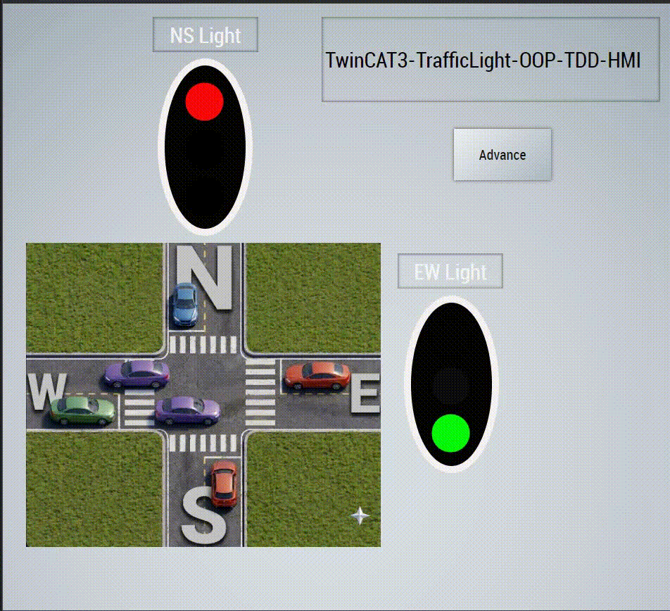
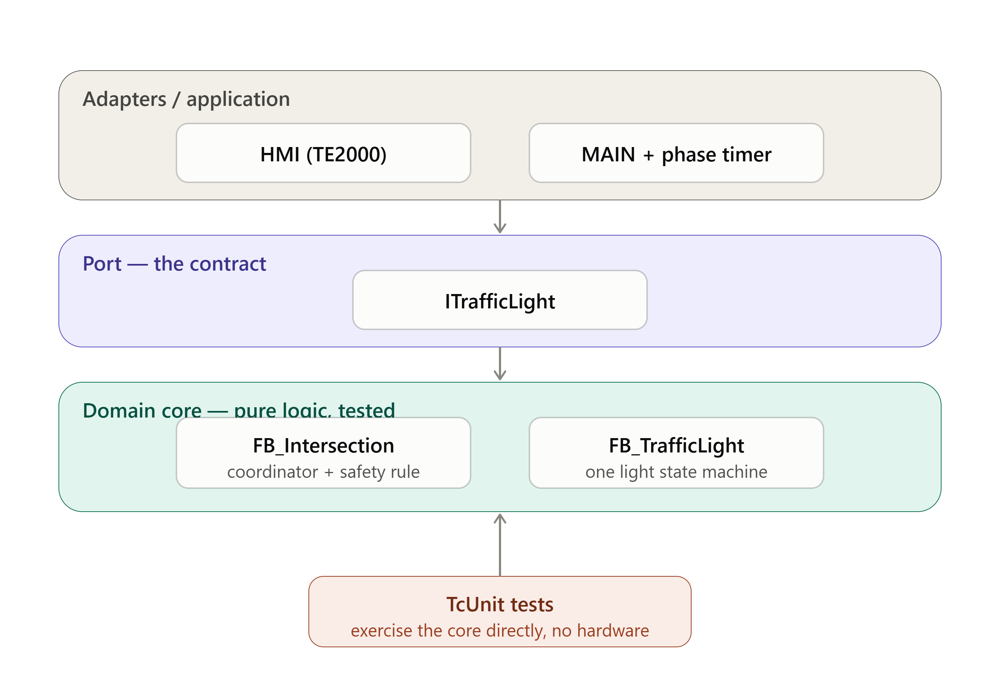
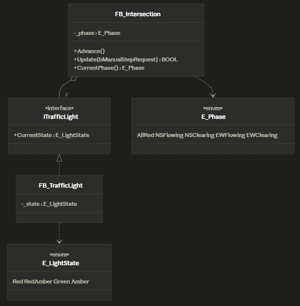

# TwinCAT 3 Traffic Light Intersection

A PLC portfolio project implementing a simulated traffic-light intersection in **TwinCAT 3**, built with **object-oriented Structured Text**, **test-driven development (TcUnit)**, an **interface-based design**, and a live **TwinCAT HMI**.

The goal isn't to control traffic lights — it's to demonstrate clean PLC software architecture, modular design, safety thinking, automated testing, and documentation, using a domain simple enough that the *engineering* stays in the foreground.



---

## Highlights

- **Object-oriented domain** — the intersection and its lights are modelled as function blocks behind an interface, not procedural logic.
- **Test-driven** — core logic built red-green-refactor with [TcUnit](https://tcunit.org/); the safety rule is verified automatically on every build.
- **Safety by design** — the intersection can never show two conflicting green directions, and this invariant is enforced in code *and* proven by an automated test.
- **Interface-based decoupling** — `FB_Intersection` depends on the `ITrafficLight` contract, not the concrete light, so the coordinator is testable in isolation and open to new light types.
- **Modular two-project layout** — a reusable domain **library** consumed by a thin **application** project.
- **Live HMI** — a TwinCAT HMI visualises the signals in real time, with a manual phase-advance control.

---

## Architecture

The design keeps a **pure domain core** (the intersection and light logic) separate from the outside world (the HMI and the application wiring). The core knows nothing about the HMI, timers, or I/O — it is driven from outside.



- **Domain core** — `FB_Intersection` (the coordinator: owns the phase state machine and the safety rule) and `FB_TrafficLight` (a single light state machine).
- **The port** — `FB_Intersection` holds its lights as `ITrafficLight` references rather than the concrete type, so the coordinator depends on the contract. Any light implementation — or a test double — can be substituted without changing the coordinator.
- **Application / adapters** — `MAIN` wires the intersection to a cyclic phase timer; the HMI reads the live state and drives the manual-advance control.

The intersection is a state machine over **phases** (`AllRed → NorthSouthFlowing → NorthSouthClearing → EastWestFlowing → EastWestClearing`), starting in the safe **all-red** state on power-up.

### Domain model



---

## The safety rule

The central requirement — *two perpendicular directions may never be green at once* — is enforced by the phase-to-colour mapping and verified by an automated test that walks the full cycle and asserts the invariant never breaks:

```pascal
// From the intersection test suite (paraphrased)
FOR i := 1 TO 12 DO
    intersection.Advance();
    AssertFalse(
        Condition := nsGreen AND ewGreen,
        Message   := 'Both directions must never be green at once');
END_FOR
```

If a future change ever introduced a conflicting-green state, this test would fail the build before it could reach hardware.

---

## Testing approach

Core logic was developed test-first with TcUnit. The suite is **intentionally focused rather than exhaustive**: each test targets a distinct behaviour or failure mode (startup state, phase sequencing, per-direction colours, the safety invariant, manual-advance edge handling) rather than enumerating every permutation. The aim is to demonstrate the method and pin down the critical behaviour; in a production system the same patterns would extend to fuller coverage.

Note that the manual-advance logic lives partly in `MAIN` (a `PROGRAM`) and depends on a real timer, which is harder to unit-test in place. The edge-detected advance itself was extracted into a testable `Update` method on `FB_Intersection`; the timer coordination in `MAIN` is verified manually.

---

## Project structure

```
src/TrafficLight/
├── TrafficLightLibPLC/     # domain library (intersection, light, ITrafficLight) + TcUnit tests
├── TrafficLightAppPLC/     # thin application: MAIN wires the intersection to a phase timer
└── (TwinCAT HMI project)   # live visualisation
docs/                        # diagrams, coding conventions, screenshots
```

The domain is packaged as a reusable **library** and consumed by the application project, so the coordinator's dependency on the `ITrafficLight` contract is genuine rather than decorative.

---

## Coding standards

The project follows the [PLCopen Coding Guidelines](docs/coding-conventions.md) for naming, comments, and practice, and PLCopen's object-oriented guidance for the interface-based design. Conventions are documented in [`docs/coding-conventions.md`](docs/coding-conventions.md).

---

## How to run

Requires TwinCAT 3 (XAE) with the TcUnit library, and TwinCAT HMI (TE2000) for the visualisation.

1. Open `src/TrafficLight/TrafficLight.sln`.
2. Build and install the `TrafficLightLibPLC` library, then build the application project.
3. Activate the application configuration, log in, and run.
4. Run the TcUnit test suite from the library project to see the tests pass.
5. Launch the HMI live view to see the intersection running.

---

## Future work

The project is deliberately scoped to a two-direction vehicle intersection. The interface-based design leaves clear extension points for the following, none of which would require changing the existing domain core:

- **Pedestrian crossing lights** — a two-state (red/green) light type implementing the same `ITrafficLight` contract, dropped in alongside the vehicle lights without modifying `FB_Intersection`.
- **Pedestrian call button** — a request input that inserts a pedestrian phase into the sequence, modelled as a sensor input into the coordinator.
- **Phase countdown timer** — a separate function block (owned by the intersection, reset on phase change) exposing a "seconds remaining" value to the HMI, so the display can show a countdown.
- **OPC UA / MQTT connectivity** — the state the HMI already reads could be exposed as a structured OPC UA information model, or streamed as MQTT telemetry, added as output adapters without touching the domain logic.
- **Control modes** — emergency all-red, night flashing-amber, and manual modes, layered above the phase state machine as a separate concern.

These are documented as design intent; each maps onto an interface or extension point that already exists in the current code.

---

## Author

**PLC / Automation Engineering — Portfolio Project**

- GitHub: [github.com/CTRL180](https://github.com/CTRL180)
- LinkedIn: [linkedin.com/in/borgesc180](https://www.linkedin.com/in/borgesc180/)
